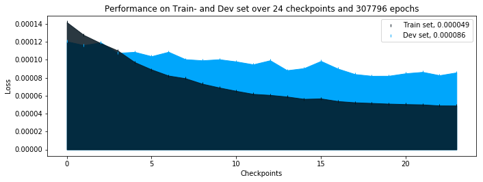

# Torch State Control

A network parameter versioning module for *PyTorch*.

 ```py
net = CustomizedLeNet5()

# Load latest network parameters.
net.load_latest_checkpoint()

# ... train the network ...

# Save current parameters.
net.save_checkpoint()
 ```

#### Features

- Save the current parameters of your network
- Keep a history of your network's states
- Load the latest parameters or jump back to an earlier version
- *Optional:* Save additional meta data such as performance along with the network parameters and make use of the included plotting methods to analyse the training process

#### Not stable

Please note that this project is currently under (heavy) development and breaking changes may be introduced at any time.

#### Works with

Last tested with **PyTorch 0.4** and **Python 3.6.4 :: Anaconda, Inc.**.

## Usage demo

You can turn your network into a "stateful module" simply by letting it inherit from `torch_state_control.nn.StatefulModule` instead of `torch.nn.Module` (as you normally would using *PyTorch*):

```py
import torch.nn as nn
from torch_state_control.nn import StatefulModule


class SuperSimpleStatefulNet(StatefulModule):

    def __init__(self):
        super().__init__("SuperSimpleStatefulNet")

        self.fc = nn.Linear(2, 1)

    def forward(self, x):
        return self.fc(x)
```
Note, that you need to pass a unique identifier for the model to `super().__init__(identifier)`, so the data that gets stored can be labeled appropriately.
Apart from this the `StatefulModule` class provides all the functionality `torch.nn.Module`s do *plus* a few methods that let you manage the state of your module easily. Thus, you can now

 ```py
net = SuperSimpleStatefulNet()

# Load latest network parameters.
net.load_latest_checkpoint()

# ... train the network ...

# Save current parameters.
net.save_checkpoint()
 ```

You can also store additional information when saving a checkpoint, like

```py
net.save_checkpoint(
    train_set_performance=1.23,
    dev_set_performance=2.34,
    losses_since_last_checkpoint=[1.23, 2.34, 3.45], # Losses for each epoch trained since last checkpoint
    notes='ADAM lr=1.23' # Use this to keep track of what learning rate you have used etc.
)
```

That way you can later use the included methods to plot the development of the performance over the past checkpoints:

```py
from torch_state_control.analysis import AnalysisPresenter

analysis_presenter = AnalysisPresenter(name=network.name)
analysis_presenter.plot_analysis()
```



In case you decide you want to go back to the checkpoint with id `9`, you can load the parameters used at that time using

 ```py
net.load_checkpoint(9)
 ```

## Installation

Clone this repository and run

```py
pip install .
```

inside the root directory to make the module available as `torch_state_control`.

## Development

*Unless noted otherwise, all commands below are expected to be executed from the root directory of this repository.*

### Building the package for local development

To make the package available locally while making sure changes to the files are reflected immediately, run

```sh
pip install -e .
```

### Test suite

Run all tests using

```sh
python -m unittest discover tests
```
